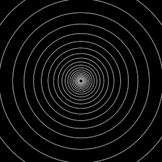

<p align="center">
   <a href="https://github.com/nitzan-treg/community_projects/">
    
  </a>
  <a href="https://github.com/nitzan-treg/community_projects/">
    
  </a>
  <a href="https://www.nitzan-tregerman.com/">
    
  </a>
  
</p>

# Davidope II
This project is very much inspired by davidope's art https://www.instagram.com/dvdp/

Its an attempt to create a satisfying looping animation in the black & white style of davidope
I used a falloff and a rotation matrix to control the animation
```c++
//get data
int prims[] = pointprims(0,i@ptnum);
float falloff = f@falloff;
matrix xform = ident();

//rotate matix
vector rnd_axis = normalize(rand(prims[0]+111));
v@rnd_axis = rnd_axis;
float rotate_amp = radians(chf('rotate_amount')*falloff);

rotate(xform,rotate_amp,rnd_axis);

v@P*=xform;
```



<p align="center">
   I share my personal projects for free with everyone.
</p> 

<p align="center">
   You are welcome to explore all of them
   <a href="https://github.com/nitzan-treg/community_projects/">
      here
   </a>
</p> 
   
